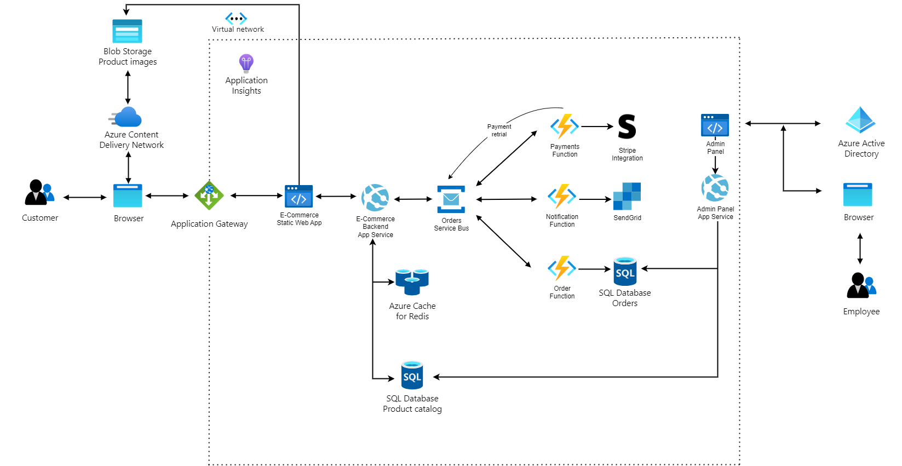

# ECommerce shop overview

The .NET e-commerce shop is a modern and robust online shopping platform designed to provide a seamless shopping experience for customers. It utilizes a variety of Azure services and technologies to ensure reliability, scalability, and performance.

**Key Components:**

- **Application Gateway**: An Azure Application Gateway is used as a secure entry point to the application. It handles SSL termination, routing, and load balancing, ensuring high availability and security.

- **Azure CDN**: To optimize content delivery and reduce latency, the shop uses Azure CDN to cache and serve static files, such as JavaScript and CSS, providing a faster browsing experience for users.

- **Azure Blob Storage**: Images and other media files are stored in Azure Blob Storage. This allows for efficient content management, scalability, and reliable storage.

- **Static Web App Frontend**: The shop's frontend is built using Angular and hosted as a static web app. It provides an interactive and user-friendly interface for customers to browse products, place orders, and manage their accounts.

- **App Service**: The shop's backend is powered by a Web API hosted in an Azure App Service. This API is responsible for handling product catalog data, processing orders, and managing user accounts.

- **Azure Cache for Redis**: Recent product searches are cached in Azure Cache for Redis, improving search performance and reducing database load.

- **Azure Service Bus Topic**: The shop's backend publishes messages to an Azure Service Bus Topic. This decouples components and enables asynchronous communication.

- **Azure Functions**:

    - Payments Function: This Azure Function integrates with Stripe for payment processing, ensuring secure and reliable transactions.
    - Notifications Function: It integrates with SendGrid to send email notifications, such as order confirmations and updates.
    - Orders Function: Responsible for managing orders, it connects to an SQL database to store order details and update order statuses.

- **Static Web App Admin Panel**: An Angular-based admin panel authenticates with Azure AD, allowing staff to efficiently process incoming orders, manage inventory, and oversee the shipping process.

- **Admin Panel App Service**: The backend app service for managing admin actions, which integrates with the Product and Orders databases

- **Application Insights**: Application Insights is used for monitoring and gaining insights into the performance and usage of the e-commerce platform. It helps identify issues, troubleshoot bottlenecks, and optimize the system.

-- **Virtual Network**: An Azure Virtual network to secure the communication between the different service

> The app in this repo is a mix between the ECommerce Backend App Service, the Order function and the Admin Panel App Service as it provides the ability to create and read orders, but it also has a Background service which simulates the processing and shipping of orders. The API is OData enabled, which provides it with great querying power for complex scenarios, which are often required in admin panels. 

# Architectural overview

